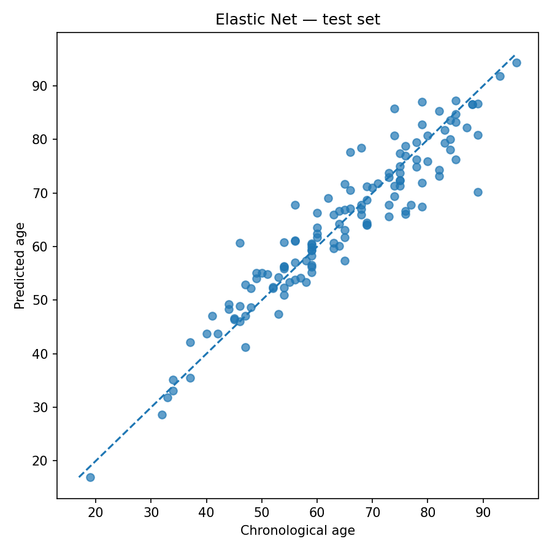
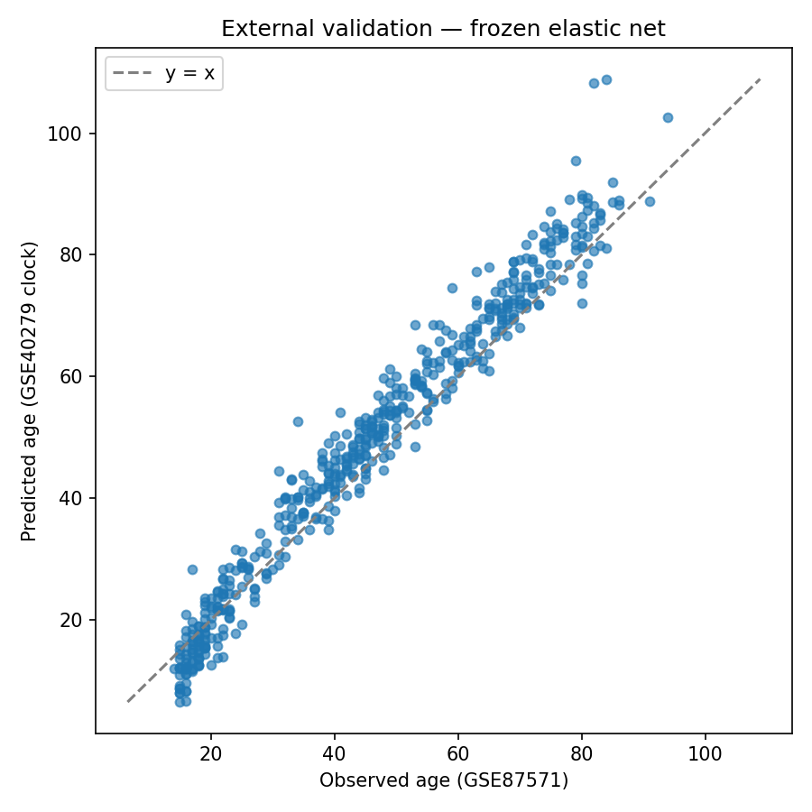
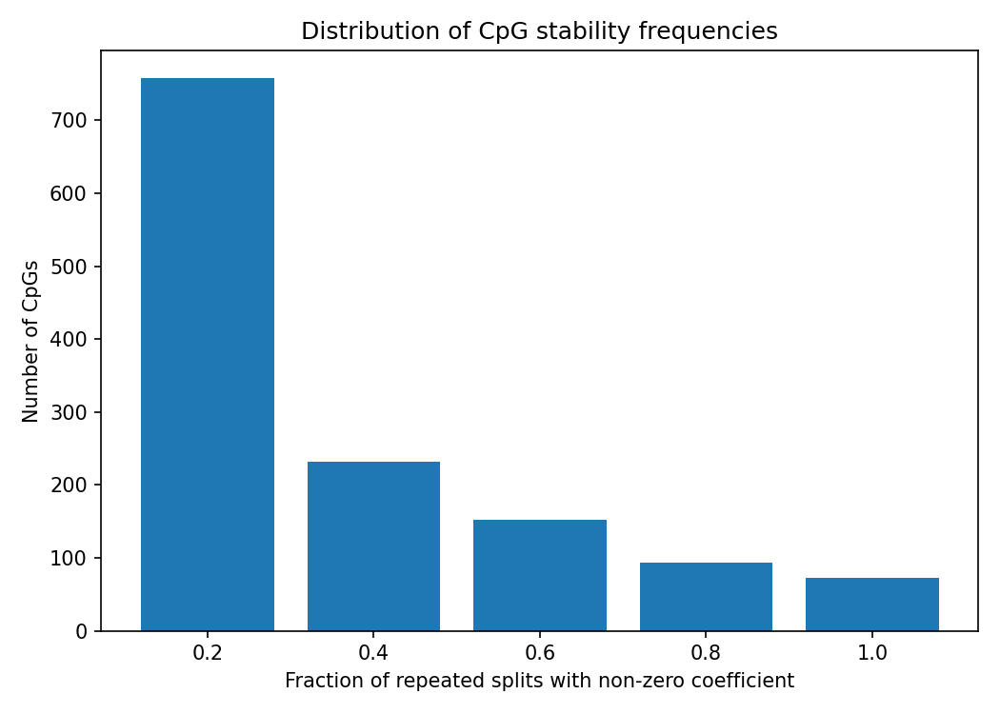
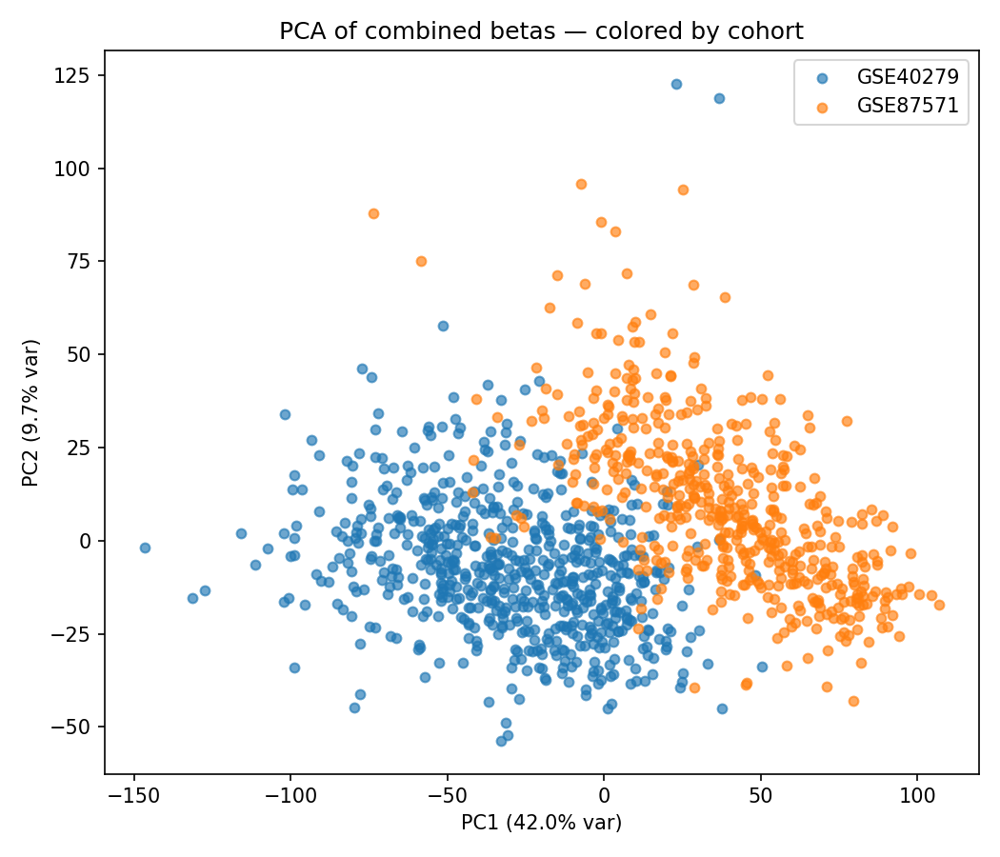
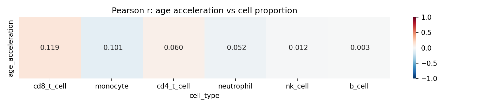

# DNA methylation aging clock — reproducible GEO pipeline (GSE40279 → GSE87571)

This repository implements a **whole-blood Illumina HumanMethylation450** aging model from public GEO data (**[GSE40279](https://www.ncbi.nlm.nih.gov/geo/query/acc.cgi?acc=GSE40279)**): train/test split precedes probe filtering; **ElasticNetCV** fits on training-derived correlation-shortlisted CpGs with **training-only scaling**. The frozen estimator is evaluated **without refitting** on an independent cohort (**[GSE87571](https://www.ncbi.nlm.nih.gov/geo/query/acc.cgi?acc=GSE87571)**). Downstream notebooks probe **interpretation and robustness**—Horvath overlap, GO enrichment, repeated-split stability, permutation controls, approximate leukocyte deconvolution, and cohort/batch diagnostics—without claiming clinical validation.

---

## Key results

Summary metrics below mirror **`results/public/*.csv`** after running the notebooks.

| Metric | Value | Source |
|--------|------:|--------|
| Internal hold-out MAE (years) | **3.704** | `model_metrics.csv` |
| Internal hold-out R² | **0.893** | `model_metrics.csv` |
| External MAE — GSE87571 (years) | **4.415** | `external_metrics.csv` |
| External R² — GSE87571 | **0.930** | `external_metrics.csv` |
| Horvath overlap Fisher exact *p* | **≈ 3.90 × 10⁻⁹** | `enrichment_results.csv` |
| Permutation control — MAE real vs shuffled (years) | **3.704 vs 14.051** | `permutation_test_metrics.csv` |
| Cohort classifier hold-out ROC-AUC (logistic, scaled) | **1.00** | `cohort_classifier_metrics.csv` |

The cohort classifier reports **near-perfect discrimination between studies** on overlapping model probes in this diagnostic setup; that flags **strong cohort-specific structure** in methylation space and must **not** be read as proof that external accuracy is “pure biology” (see **Biological robustness** and **Limitations**).

---

## Key figures

Figures are stored under **`results/public/`** so GitHub can render them when mirrored from **`results/`** after **Restart Kernel & Run All** (see **Reproducibility**). If an image does not display, regenerate notebooks and refresh mirrors per **`results/public/README.md`**.

### Internal fit — predicted vs chronological age (GSE40279 hold-out)



**Caption.** Scatter of **predicted age** versus **chronological age** on the leakage-safe hold-out split. This summarizes **within-study** calibration after correlation-based dimension reduction and Elastic Net fitting; it does **not** substitute for external transportability.

---

### External validation — frozen clock on GSE87571



**Caption.** Application of the **frozen** scaler and Elastic Net from **GSE40279** to **GSE87571** supplementary betas (no refit). Agreement reflects **transport under real-world preprocessing drift** between studies; interpret alongside batch diagnostics and limitations on preprocessing parity.

---

### Probe stability across repeated train/test splits



**Caption.** Histogram of how often probes receive **non-zero coefficients** across repeated seeds with **per-split correlation filtering**. This probes whether selected probes are stable artifacts of a single split versus recurrent across partitions—a minimal stability audit, not a full biomarker validation.

---

### Cohort structure — PCA on overlapping model CpGs (GSE40279 vs GSE87571)



**Caption.** **PCA** restricted to **overlapping training-defined CpGs** after concatenating cohorts. Separation along principal components is consistent with **study-specific methylation structure** (technical and/or biological). This diagnostic **does not** apply **ComBat** or harmonization; it contextualizes external metrics.

---

### Cell composition vs epigenetic age acceleration — correlation heatmap



**Caption.** Reference-based **approximate** blood deconvolution (Houseman-style constrained projection against a Reinius 450K panel). Correlations with **`age_acceleration = predicted − chronological`** test whether residuals align with inferred immune fractions—an exploratory **confounding screen**, not clinical immune phenotyping. Numeric values: **`age_acceleration_celltype_correlations.csv`**.

---

## Scientific motivation

**Epigenetic clocks** (e.g., Horvath, Hannum, and derivatives) predict age or related outcomes from array methylation; many probes overlap pathways tied to development and cell-state transitions. Supervised reconstruction from **blood** is especially prone to **composition and batch effects**.

This project emphasizes **reproducible methodology**: **train-test leakage control** (probe ranking and scaling on training rows only), **permutation** and **stability** checks, **external application** of a frozen model, and **post hoc** biological annotation—not claiming a new clinical biomarker, but documenting whether a transparent Elastic Net baseline behaves sensibly under public supplementary data constraints.

**Leakage controls (summary).** Correlation-based probe shortlisting and **`StandardScaler`** fitting use **training rows only**; test labels are excluded from preprocessing. External evaluation applies **frozen** coefficients and training-derived scaling to external β values—no refit on external labels.

---

## Pipeline overview

| Step | Notebook | Role |
|------|------------|------|
| 1 | **`notebooks/01_data_loading.ipynb`** | GEO ingestion; align Illumina 450K betas with ages and metadata; export processed matrices. |
| 2 | **`notebooks/02_model_training.ipynb`** | Train/test split → correlation-shortlisted CpGs → **StandardScaler** + **ElasticNetCV**; stability and permutation analyses. |
| 3 | **`notebooks/03_biological_interpretation.ipynb`** | Manifest merge; **Horvath** overlap (Fisher); **g:Profiler** GO enrichment. |
| 4 | **`notebooks/04_external_validation.ipynb`** | Load frozen **`scaler.joblib`**, **`elasticnet_model.joblib`**, **`selected_cpgs.csv`**; evaluate on **GSE87571** without refitting. |
| 5 | **`notebooks/05_biological_and_batch_effect_analysis.ipynb`** | Approximate leukocyte deconvolution vs acceleration; **PCA** / optional **UMAP**; cohort classifier — **diagnostic only** (no **ComBat**). |

---

## Biological robustness analyses

The workflow asks whether apparent aging signal plausibly reflects **shared biology** versus **technical cohort structure**:

| Layer | Question addressed | Outputs (examples) |
|-------|-------------------|----------------------|
| **Repeated splits** | Are metrics and selected probes stable across partitions? | `repeated_split_metrics.csv`, `cpg_stability_frequency_distribution.png` |
| **Permutation** | Does performance collapse when labels are shuffled? | `permutation_test_metrics.csv` |
| **Horvath overlap** | Do training-selected probes overlap published clock probes non-randomly? | `horvath_overlap.csv`, Fisher row in `enrichment_results.csv` |
| **GO enrichment** | Are candidates enriched for coherent biology (exploratory)? | `enrichment_results.csv` |
| **Deconvolution screen** | Do acceleration residuals track inferred leukocyte fractions (composition confounding)? | `age_acceleration_celltype_correlations.csv`, heatmap/scatters |
| **Batch / cohort diagnostics** | Are cohorts trivially separable in probe space (batch structure)? | `pca_by_cohort.png`, `cohort_classifier_metrics.csv` |

Together, these checks frame conclusions cautiously: strong internal fit **coexists with** strong cohort separability on overlapping probes—consistent with **residual technical or study-aligned biology** that **full harmonization** would be needed to dissect further.

---

## Dataset (training cohort)

| Property | Description |
|----------|-------------|
| GEO accession | [GSE40279](https://www.ncbi.nlm.nih.gov/geo/query/acc.cgi?acc=GSE40279) |
| Tissue | Whole blood |
| Samples | 656 (methylation + age aligned) |
| Assay | Illumina HumanMethylation450 (GPL13534) |
| Features | ~473k CpG β values (473,034 probes in processed matrices) |

---

## Limitations

These constraints bound interpretation; they are methodological boundaries, not shortcomings of reproducibility work.

- **Supplementary beta matrices** — Pipeline starts from **GEO supplementary / averaged β** tables, **not raw IDAT** intensity files or a standard **minfi** / **preprocessQuantile** (or similar) IDAT workflow.
- **No unified cross-study normalization** — Training and external cohorts are **not** forced through identical normalization beyond applying **training** scaler coefficients on external probes.
- **No ComBat / SVA** — No study-wide **ComBat** or **surrogate variable analysis** on β matrices; notebook **05** only **diagnoses** cohort separation.
- **No SNP-based samples QC or cross-reactive probe filtering** — Standard probe-mask workflows are **not** implemented here.
- **Plate effects** — Within-GSE40279 plate structure is **not** modeled with a dedicated batch covariate in the Elastic Net.
- **Deconvolution** — Reference projection is an **approximate sanity screen**, not a publication-grade **Houseman**/**EpiDISH** replication or clinical immunology.
- **External validation scope** — Results depend on **public supplementary formatting** and compatible Illumina blood studies; metrics are **compatibility checks**, **not** clinical endpoint validation.
- **Single training cohort** — Generalization beyond **whole blood** / **GSE40279** is **not** established.

---

## Reproducibility

### Installation

```bash
python -m venv .venv
.venv\Scripts\activate          # Windows
# source .venv/bin/activate     # macOS / Linux
pip install -r requirements.txt
```

### Notebook workflow

1. **Python 3.11+** and dependencies from **`requirements.txt`** (pinned versions).
2. Working directory for notebooks is **`notebooks/`**; paths resolve **`PROJECT_DIR = Path.cwd().parent`** (portable).
3. Run **01 → 02 → 03**, then optionally **04** (large GEO downloads) and **05** (requires **02** artifacts; external matrices download like **04** if absent).
4. Use **Restart Kernel & Run All** per notebook.
5. **`data/raw/`** and **`data/processed/`** are **gitignored** except placeholders; large matrices stay local.
6. **`results/`** is mostly **gitignored**; **`results/public/`** holds **small CSV + PNG mirrors** for GitHub; copy refreshed artifacts from **`results/`** as needed (`results/public/README.md`).

Optional **UMAP** in **05** requires **`umap-learn`** (not pinned in **`requirements.txt`**).

---

## Repository structure

```
epigenetic-clock-reproduction/
├── data/
│   ├── raw/              # GEO downloads (gitignored contents)
│   └── processed/      # X, y, model artifacts from notebooks (gitignored)
├── notebooks/
│   ├── 01_data_loading.ipynb
│   ├── 02_model_training.ipynb
│   ├── 03_biological_interpretation.ipynb
│   ├── 04_external_validation.ipynb
│   └── 05_biological_and_batch_effect_analysis.ipynb
├── results/
│   └── public/         # Lightweight CSV + PNG mirrors for GitHub
├── scripts/            # Optional utilities
├── requirements.txt
└── README.md
```

---

## Selected output artifacts

| Location | Contents |
|----------|----------|
| `data/processed/` | `X.pkl.gz`, `y.csv`, `scaler.joblib`, `elasticnet_model.joblib`, `selected_cpgs.csv` |
| `results/` | Full notebook outputs (mostly ignored) |
| `results/public/` | Metrics CSVs and figure mirrors for documentation |

---

## Future work

- Raw **IDAT** ingestion and parity with Bioconductor preprocessing stacks.
- Formal **Houseman / EpiDISH** comparisons and alternative reference panels.
- **Harmonization** (e.g., ComBat on β) informed by cohort diagnostics.
- Additional **external cohorts** and nested cross-validation where feasible.

---

## References

- Horvath S. DNA methylation age of human tissues and cell types. *Genome Biol.* 2013;14(10):R115. [https://doi.org/10.1186/gb-2013-14-10-r115](https://doi.org/10.1186/gb-2013-14-10-r115)
- Houseman EA, et al. DNA methylation arrays as surrogate measures of cell mixture distribution. *BMC Bioinformatics.* 2012;13:86.
- NCBI GEO series GSE40279. [https://www.ncbi.nlm.nih.gov/geo/query/acc.cgi?acc=GSE40279](https://www.ncbi.nlm.nih.gov/geo/query/acc.cgi?acc=GSE40279)
- Illumina HumanMethylation450 BeadChip documentation (GPL13534).
- Raudvere U, et al. g:Profiler (2019 update). *Nucleic Acids Res.* 2019;47(W1):W191–W198. [https://doi.org/10.1093/nar/gkz369](https://doi.org/10.1093/nar/gkz369)
